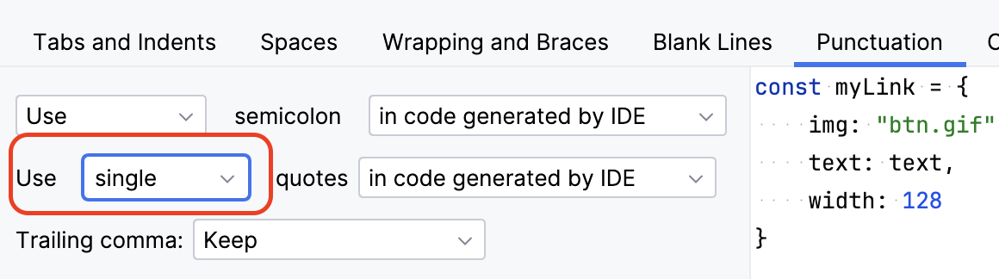
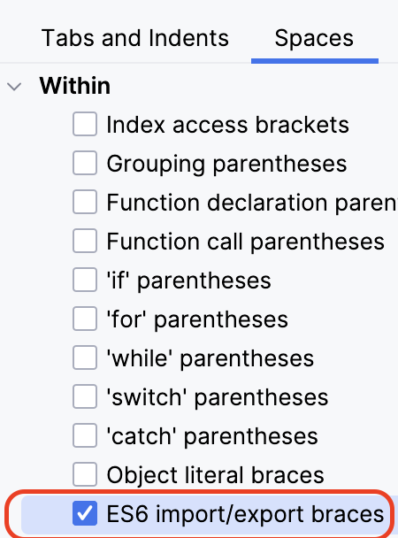
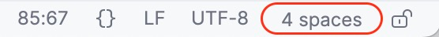

:sectnums:

= Frontend Web App image:https://github.com/manoelcampos/react-springboot-feature-driven-arch-sample/actions/workflows/frontend-build.yml/badge.svg[frontend-build,link=https://github.com/manoelcampos/react-springboot-feature-driven-arch-sample/actions/workflows/frontend-build.yml]

Application built TypeScript on http://nodejs.org[Node.js] using the http://nextjs.org[Next.js] framework with https://react.dev[React] library and link:https://mantine.dev[Mantine] components. The application consumes the REST services exposed by the link:../backend[backend].

== Tooling

This project uses Yarn as the package manager. To install the version used by the project, run:

[source,bash]
----
make install

----

== Build and run the application

The link:.env.sample[.env.sample] file must be duplicated as ".env".
This file is not versioned and should include the settings appropriate for your development environment.

To install dependencies, build the project, and run the app, execute:

[source,bash]
----
make app
----

== Create a Docker container

To create a Docker container with the application, run:

[source,bash]
----
make docker
----

== npm scripts

=== Build and Dev scripts

* `dev` – starts the development server
* `build` – bundles the application for production
* `analyze` – analyzes the application bundle with https://www.npmjs.com/package/@next/bundle-analyzer[@next/bundle-analyzer]

=== Test scripts

* `typecheck` – runs TypeScript type checking
* `lint` – runs ESLint
* `prettier:check` – checks files with Prettier
* `jest` – runs tests with Jest
* `jest:watch` – starts Jest in watch mode
* `test` – runs `jest`, `prettier:check`, `lint`, and `typecheck`

=== Other scripts

* `storybook` – starts the Storybook development server
* `storybook:build` – builds Storybook for production into `storybook-static`
* `prettier:write` – formats all files with Prettier

== IDE

Using IntelliJ IDEA (or WebStorm) as the IDE for development is recommended.
Since the project uses ESLint to define formatting style and check for code issues,
when using IntelliJ features like ALT+ENTER to fix issues or to add imports,
IntelliJ will not use the settings defined in link:eslint.config.js[eslint.config.js].

Therefore, some manual IDE settings are suggested.
Open the `Settings` menu in IntelliJ and go to `Editor > Code Style > TypeScript` in the left sidebar (or type TypeScript in the search field to find the option). Then follow the steps below:

* Use Single Quotes: go to the `Punctuation` tab and select the option highlighted below:

* Include spaces around import/export braces: go to the `Spaces` tab and select the option highlighted below:

* Indentation: TypeScript files are configured to use 4 spaces. To confirm the IDE is set correctly, open a `.ts` or `.tsx` file and check the bottom-right corner of the IDE as shown below. If not, click there and set it to 4 spaces:

=== Import Order

Unfortunately, even though there is a configuration to define the order of imports,
they do not always end up as defined in link:eslint.config.js[eslint.config.js].
To work around this, open `Languages & Frameworks > JavaScript > Code Quality Tools > ESLint` in IntelliJ `Settings` (or search for ESLint) and check `Run eslint --fix on save`. This way, if there are issues in the code, simply saving the file will allow ESLint to fix some of them (such as incorrect import order).

== Libraries Documentation

Here are the links to the documentation of the libraries used in the project:

* link:[https://nextjs.org/docs] - Next.js is a React framework for building web applications.

* link:[https://mantine.dev/getting-started/] - Mantine is a set of accessible, customizable React components with lots of built-in features.

* link:[https://ui.mantine.dev/] - Mantine UI is a collection of responsive and accessible React components.

* link:[https://icflorescu.github.io/mantine-datatable/] - Mantine Datatable is a customizable, responsive, and easy-to-use React data table.

* link:[https://tablericons.com/] - Tabler Icons is a free and open-source icon set.

* link:[https://zod.dev/] - Zod is a TypeScript-first schema validation library focused on type-safety and performance.

== Useful Links and Articles to Understand the Project Structure

- "How to Structure Your Next.js App with the New App Router" - link:https://betterprogramming.pub/how-to-structure-your-next-js-app-with-the-new-app-router-61bf2bf5a20d[]
- "Next.js v13: App Directory" - link:https://medium.com/walmartglobaltech/next-js-v13-app-directory-ecd58c477603[]
- "Atomic Design: What it is, how it emerged, and its importance for creating a Design System" - link:https://medium.com/pretux/atomic-design-o-que-%C3%A9-como-surgiu-e-sua-import%C3%A2ncia-para-a-cria%C3%A7%C3%A3o-do-design-system-e3ac7b5aca2c[]
Os slides estão em https://app.presentations.ai/view/vIadqjos7v
